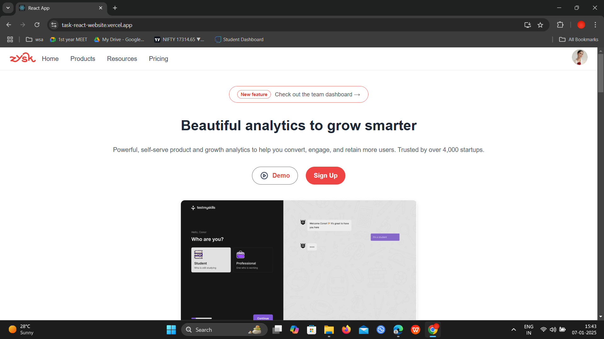

# React Assignment

## Live App
[Live Demo](https://task-react-website.vercel.app/)

## Installation

1. Clone the repository:
   ```bash
   git clone https://github.com/UdayShankar3953/Task_React_Website.git
   ```
2. Navigate to the project directory:
   ```bash
   cd Task_React_Website
   ```
3. Install the required dependencies:
   ```bash
   npm install
   ```

---

## Running the Project

To start the development server:
```bash
npm start
```
The app will be available at `http://localhost:3000`.

---

## Technologies Used

- **Frontend**: React.js
- **Styling**: CSS
- **Package Manager**: npm

---

## Screenshots

### Desktop Version





---

### Mobile Version


